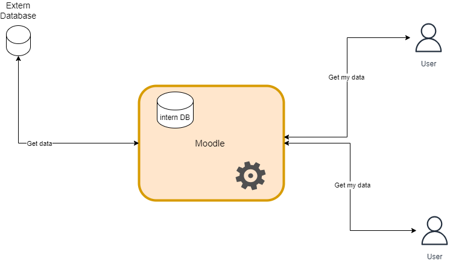
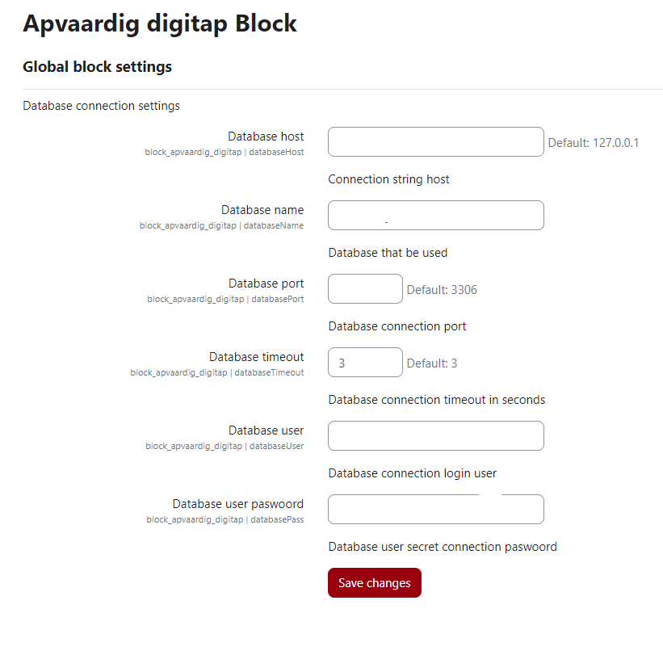

# Apvaardig_digitap
## scheme
 
## Apvaardig  digitap  Moodle plug-in
Moodle Plugin block <strong>apvaardig_digitap</strong> is a plugin block for Moodle that adds functionality to the Moodle platform.

Installation
Download the plugin from the GitHub repository.
Extract the plugin files to the <strong>/blocks/apvaardig_digitap</strong> directory in your Moodle installation.
Log in to your Moodle site as an administrator and go to Site administration > Notifications.
Follow the on-screen instructions to install the plugin.
Usage
Moodle Plugin Name adds a new feature to the Moodle platform. To use the feature, follow these steps:

Navigate to the page where you want to use the feature.
Click on the button to activate the feature.
Follow the on-screen instructions to use the feature.
Configuration
Moodle Plugin Name can be configured using the settings page in the Moodle administration panel. To access the settings page, follow these steps:

Log in to your Moodle site as an administrator.
Go to Site administration > Plugins > Local plugins > Moodle Plugin Name.
Configure the settings as desired.
Click Save changes to save the settings.
Support
If you encounter any issues or have any questions about Moodle Plugin Name, please contact the plugin developer at <strong>John S.</strong> p056948@ap.be.
# Settings
Configuration of connection to the extern database. If you have any issue with the connection please check first the firewall. 
 
## plugin-settings
# Data model
This plug-in use automapper-plus as extra library to map Models and ModelDtos.
## Models and ModelDtos
## Data Model from extern database
## intern data modelDto mapping

# Languages

# License
Moodle Plugin apvaardig_digitap is licensed under the GNU GPL v3 or later. See the LICENSE file for details.

# Credits
Moodle Plugin apvaardig_digitap was developed by <strong>John S.</strong> and is maintained by <strong>John S.</strong>.
